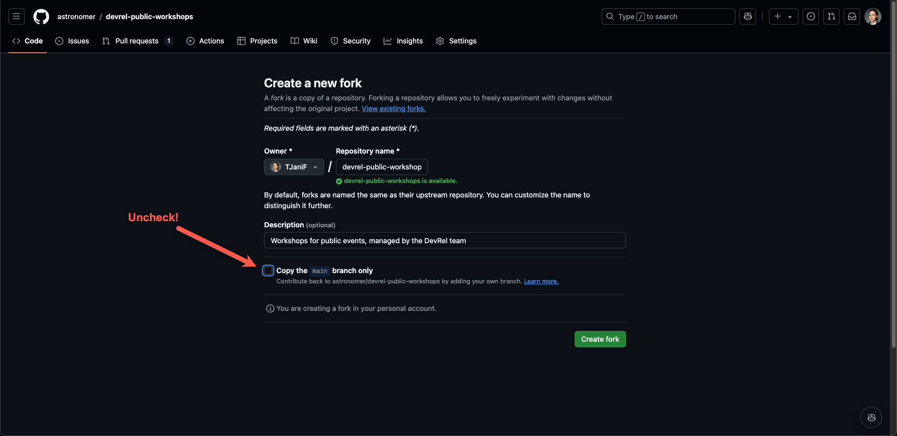
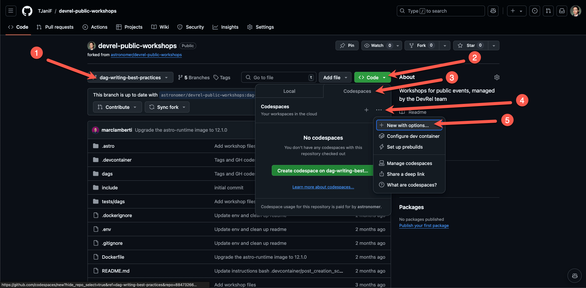
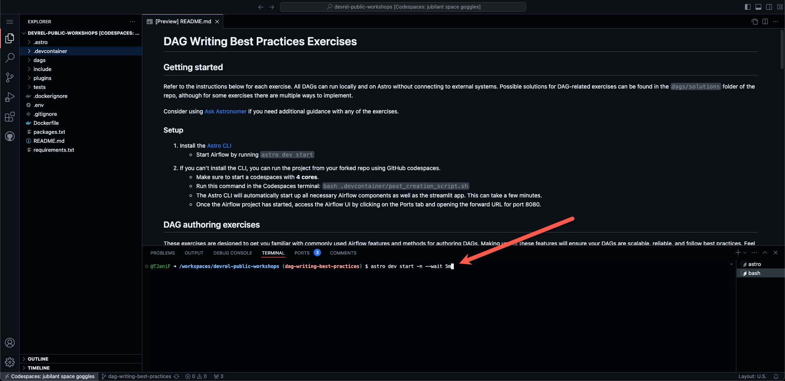

# DAG Writing Best Practices Exercises

Welcome! 🚀

This is the repository for the Astronomer DAG Writing Best Practices workshop. The workshop is designed to help you learn about Airflow best practices by working through a series of exercises.

You can find a recording of the workshop, including a walk-through of the exercises [here](https://www.astronomer.io/events/webinars/dag-writing-best-practices-video/).

## How to use this repo

Set up your environment by following the instructions in the [Setup](#setup) section below. All DAGs in this repository can be run locally and on Astro without connecting to external systems. [Exercises 1-4](#dag-writing-exercises) are focussed on DAG writing and can be completed in a local environment. [Exercises 5-8](#day-2-dag-operations-exercises) are focussed on deploying and testing DAGs and exercises 5-7 require an Astro deployment. If you do not have an Astro account yet, you can sign up for a free trial [here](http://q-r.to/dag-workshop-astro-trial).

Sample solutions for DAG-writing related exercises can be found in the [`dags/solutions`](/dags/solutions/) folder of the repo, note that some exercises can be solved in multiple ways.

> [!TIP]
> Consider using [Ask Astro](ask.astronomer.io) if you need additional guidance with any of the exercises.

### Setup

To set up a local Airflow environment you have two options, you can either use the Astro CLI or GitHub Codespaces.

#### Option 1: Astro CLI

1. Make sure you have [Docker](https://docs.docker.com/get-docker/) installed and running on your machine.
2. Install the free and open-source [Astro CLI](https://www.astronomer.io/docs/astro/cli/install-cli).
3. Fork this repository and clone it to your local machine. Make sure you uncheck the `Copy the main branch only` option when forking.

   

4. Run `astro dev start` in the root of the clone repository to start the Airflow environment.
5. Access the Airflow UI at `localhost:8080` in your browser. Log in using `admin` as both the username and password.

#### Option 2: GitHub Codespaces

If you can't install the CLI, you can run the project from your forked repo using GitHub Codespaces.

1. Fork this repository. Make sure you uncheck the `Copy the main branch only` option when forking.

   

2. Make sure you are on the `dag-writing-best-practices` branch.
3. Click on the green "Code" button and select the "Codespaces" tab. 
4. Click on the 3 dots and then `+ New with options...` to create a new Codespace with a configuration, make sure to select a Machine type of at least `4-core`.

   

5. Run `astro dev start -n --wait 5m` in the Codespaces terminal to start the Airflow environment using the Astro CLI. This can take a few minutes.

   

   Once you see the following printed to your terminal, the Airflow environment is ready to use:

   ```text
   Airflow is starting up!

   Project is running! All components are now available.

   Airflow Webserver: http://localhost:8080
   Postgres Database: localhost:5435/postgres
   The default Airflow UI credentials are: admin:admin
   The default Postgres DB credentials are: postgres:postgres
   ```

6. Once the Airflow project has started, access the Airflow UI by clicking on the Ports tab and opening the forward URL for port `8080`.
7. Log into the Airflow UI using `admin` as both the username and password. It is possible that after logging in you see an error, in this case you have to open the URL again from the ports tab.

## Exercises

The exercise DAGs are located in the [`dags/exercises`](dags/exercises/) folder. They are tagged with `exercise` as well as their exercise number.

## DAG writing exercises

These exercises are designed to get you familiar with commonly used Airflow features and methods for authoring DAGs. Making use of these features help make your DAGs more scalable and reliable and easier to troubleshoot. Feel free to use the following resources:

- [Datasets and Data-Aware Scheduling in Airflow guide](https://www.astronomer.io/guides/airflow-datasets/)
- [Dynamic task mapping guide](https://www.astronomer.io/docs/learn/dynamic-tasks)

DAGs:

- [`upstream_dag_1`](dags/exercises/upstream_dag_1.py): Retrieves weather data for a list of cities.
- [`upstream_dag_2`](dags/exercises/upstream_dag_2.py): Retrieves historical weather data for a specific city and date.
- [`downstream_dag`](dags/exercises/downstream_dag.py): Creates a report based on data generated from the two upstream DAGs.

### Exercise 1: Use Datasets

TAG: `exercise_1`

With Datasets, DAGs that access the same data can have explicit, visible relationships, and DAGs can be scheduled based on updates to these datasets. This feature helps to make Airflow data-aware and expands Airflow scheduling capabilities beyond time-based methods such as cron.

Currently, the `downstream_dag` DAG is dependent on the data generated by the `upstream_dag_1` and `upstream_dag_2` DAGs, let's use Datasets to use this dependency in the schedule for the `downstream_dag`!

#### Task:

Define a schedule for the downstream DAG to run with the following schedule:

- every day at midnight UTC **AND** 
- whenever both the "current_weather_data" and "max_temp_data" datasets are updated **AND**
- ONE OF the datasets "wind_speed_data" **OR** "wind_direction_data" is updated.

To implement this you will need to modify:

- The `create_weather_table` task in the [`upstream_dag_1`](dags/exercises/upstream_dag_1.py) DAG to produce an update to the "current_weather_data" dataset.
- The `get_max_wind` and `get_wind_direction` tasks in the [`upstream_dag_2`](dags/exercises/upstream_dag_2.py) DAG to produce updates to the "wind_speed_data" and "wind_direction_data" datasets respectively.
- The schedule of the [`downstream_dag`](dags/exercises/downstream_dag.py) DAG with a [DatasetOrTimeSchedule](https://www.astronomer.io/docs/learn/airflow-datasets/#combined-dataset-and-time-based-scheduling).

See the DAG code comments for more hints.

For the solution see [`dags/solutions/`](dags/solutions/).

### Exercise 2: Dynamic Task Mapping

With dynamic task mapping, you can write DAGs that adapt to your data at runtime! This is useful when you want to run a task for each item in a list. 

Currently the [`upstream_dag_1`](dags/exercises/upstream_dag_1.py) DAG is set up to retrieve weather data for just one city, let's modify it to retrieve weather data for multiple cities in parallel!

#### Task

Dynamically map the `get_lat_long_for_one_city` task over a list of cities returned by the `get_cities` task in the `upstream_dag_1` DAG.

To implement this you will need to modify:
- The `get_cities` task in the [`upstream_dag_1`](dags/exercises/upstream_dag_1.py) DAG to return a list of cities.
- The `get_lat_long_for_one_city` task in the [`upstream_dag_1`](dags/exercises/upstream_dag_1.py) DAG to be dynamically mapped over the list of cities. 

See the DAG code comments and the [Dynamic Tasks guide](https://www.astronomer.io/docs/learn/dynamic-tasks/) for more hints.

For the solution see [`dags/solutions/upstream_dag_1.py`](dags/solutions/upstream_dag_1.py).

### Exercise 3: DAG parameters

It is a best practice is to let your tasks retry by default to handle task failures and prevent many consecutive failed DAG runs. This can be achieved by using [DAG parameters](https://www.astronomer.io/docs/learn/airflow-dag-parameters/). 

#### Task

For the [`downstream_dag`](dags/exercises/downstream_dag.py) DAG:

- Set all tasks in the DAG to retry 3 times by default and give them a new owner (you!).
- Make sure the DAG never has more than 6 consecutive failed runs.

See the DAG code comments for more hints.

For the solution see [`dags/solutions/downstream_dag.py`](dags/solutions/downstream_dag.py).

### Exercise 4: Avoid top-level DAG code

Top-level DAG code is an [Airflow anti-pattern](https://www.astronomer.io/docs/learn/dag-best-practices#avoid-top-level-code-in-your-dag-file). Because the DAG processor executes the `.py` files that contain DAGs, all code that's not contained within the context of a task will be executed, which could easily result in DAGs failing to parse.

#### Task

Rewrite the [`top_level_code`](/dags/exercises/top_level_code.py) DAG to move the top-level DAG code into a task. Then you can proceed to calculate the meaning of life, the universe, and everything.

## Day 2 DAG Operations exercises

Now that DAGs are written, we'll cover deploying DAGs and some of the Day 2 operations that Astro enables.

Feel free to use the following resources:

- [Deploy code to Astro](https://www.astronomer.io/docs/astro/deploy-code)
- [Astro alerts](https://docs.astronomer.io/astro/alerts)
- [Test your Astro project](https://www.astronomer.io/docs/astro/cli/test-your-astro-project-locally)

### Exercise 5: Start a trial and create a Deployment

1. Start an Astro trial using [this link](http://q-r.to/dag-workshop-astro-trial ). You can choose a template project to deploy if you wish, or you can skip this step.
2. Create a new, empty Airflow Deployment in your Astro workspace with default settings.

### Exercise 6: Deploy code to Astro

Now that you have a Deployment, you can deploy the code we just worked on. You have two options for this workshop:

1. Deploy using the Astro CLI by running `astro login` to sign in to your trial, and then `astro deploy`.
2. Use the [GitHub Integration](https://www.astronomer.io/docs/astro/deploy-github-integration/) to connect your Astro workspace to your GitHub account and deploy by pushing the code to your fork of the repo. This way you can deploy code even if you don't have the Astro CLI installed.

### Exercise 7: Create an Astro alert

Astro alerts provide an additional layer of observability over Airflow's built-in alerting system. In the exercises/ folder, one of the DAGs helps highlight this functionality. [`upstream_dag_1`](dags/exercises/upstream_dag_1.py) is parameterized to run with user input. You can simulate a failure of the API that data is retrieved from or a time delay in a task completing.

#### Task

Set up two alerts in your Astro deployment: 

1. A DAG failure alert for the [`upstream_dag_1`](dags/exercises/upstream_dag_1.py) DAG. (you can also use the Solution version of the DAG!)
2. A task duration alert for the `simulate_task_delay` task in [`upstream_dag_1`](/dags/exercises/upstream_dag_1.py) (try 1 minute). 

For both alerts, choose email as the communication channel. Try out the alerts by running the [`upstream_dag_1`](dags/exercises/upstream_dag_1.py) with the `Simulate API failure` param set to `True` and the `simulate_task_delay` param set to `120` seconds.

### Exercise 8: Write a DAG validation test

The Astro CLI includes commands that you can use to test and debug DAGs both inside and outside of a locally running Airflow environment. Tests can then be set up to automatically run as part of a CI/CD workflow. Implementing DAG validation tests help you ensure that any new DAG code adheres to your organization’s standards and won’t cause issues in production.

#### Task

Update the appropriate test in the test directory of your Astro project to check that all DAGs have at least `3` retries by default. Run the test using the Astro CLI `astro dev pytest` command. See what happens if you run the test when retries are not set for one of the DAGs.
